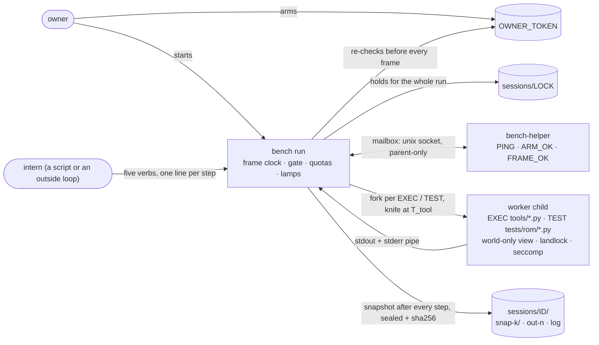
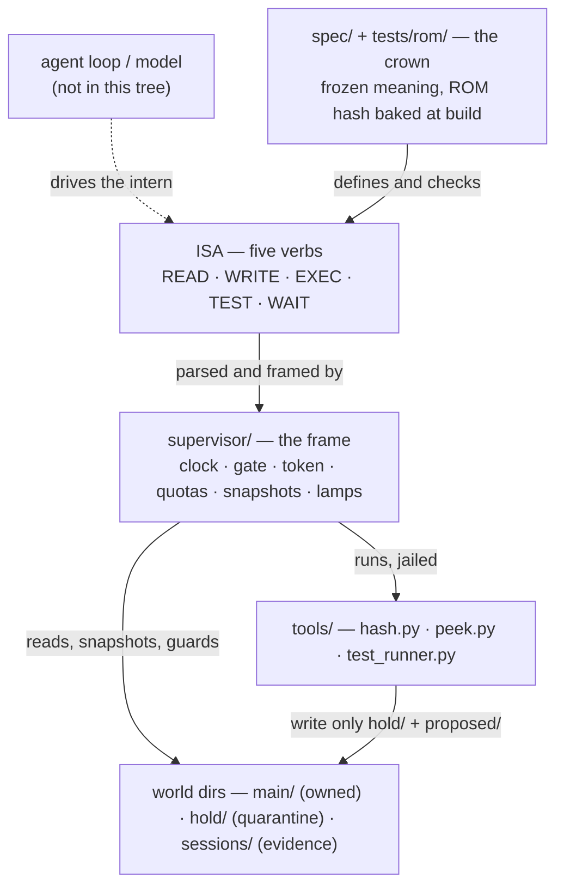

# Bench

[](LICENSE)
[](#requirements)
[](docs/ci.md)
[](https://infraax.github.io/Bench/)

**Site: <https://infraax.github.io/Bench/>** — architecture, a script [playground](https://infraax.github.io/Bench/playground/),
every refusal [rule](https://infraax.github.io/Bench/rules/), measured costs, and a machine side for agents
([`llms.txt`](https://infraax.github.io/Bench/llms.txt), [`/api/*.json`](https://infraax.github.io/Bench/api/index.json)).

**Bench is the custody crypt, not an agent.** An agent loop is somebody else's: it thinks, it
calls a model, it decides what to try. Bench is the room that loop works in. It hands the worker
(the *intern*) five verbs and nothing else, runs each one as a framed step under a clock and
quotas, keeps a sealed, content-hashed snapshot after every step, and lets only the owner crown
anything into the main tree. The intern can labor in quarantine; it cannot arm the room, widen
its own budget, or touch what the owner owns. There is no model in this tree.

### Who starts whom



The intern has no path to the helper, the token, the lock or the log: it only hands `bench` lines
of text, which the parser accepts as one of five verbs or refuses with a rule id.

### How the layers stack



More: [`docs/architecture.md`](docs/architecture.md) (the frame step by step, rings, workers).

Product tip: the repository's default branch — an owner setting (see [`docs/github.md`](docs/github.md)).
License: **MIT OR Apache-2.0**.

## Requirements

- **Linux only** (seccomp, landlock ≥ 5.13, mount/user namespaces). It does not build on macOS.
- A C11 compiler, `make`, Python 3.10+ (stdlib only; pytest used if present), `git`.
- Debian/Ubuntu: `sudo apt-get install -y build-essential python3 git`
  (or `sh scripts/bootstrap-debian.sh`).

## Install and test

```
git clone <this repo> bench && cd bench
make env            # machine card -> ledger/latest/ENV.txt; exits 2 with the install line if something is missing
make test-rom       # bus + ROM only: pure, no worker children (what hosted CI runs)
make test           # bus, ROM, harness with worker children — offline, the full gate
make ledger-test    # the full gate, logged to ledger/<stamp>-<sha>/; prints only a summary
```

**Agents on a Linux laptop or box:** `make env && make ledger-test` before inventing work, and
paste the summary, not the log. See [`docs/agent.md`](docs/agent.md). Hosted CI runs compile +
`make test-rom` only; the full gate is the ledger — see [`docs/ci.md`](docs/ci.md).

## One run

```
make                                          # build bench + helper, crown the ROM
: > sessions/OWNER_TOKEN                      # arm (owner); rm it to disarm
echo hello > main/hello.txt
printf 'READ fs main/hello.txt\nWRITE fs hold/out.txt hi\nEXEC tools/hash.py hold/out.txt\n' > touch.ops
./supervisor/bench run touch.ops              # one frame per line, a snapshot after each
./supervisor/bench status --line              # the whole board on one line
./supervisor/bench verify                     # re-hash every snapshot of the session
```

A refused line names its rule and the fix:

```
FAULT line 2: ring: intern writes hold/ or proposed/ only, not main/x
  rule=write-ring fix: write under hold/ or proposed/; main/ is Ring 0
```

`make e2e` runs the same kind of fixture in a scratch world. Owner commands and exit codes:
[`docs/handbook.md`](docs/handbook.md).

## Lamps

`status` shows the lamp byte: **MAIN** (a crowned change reached `main/`; dark in this tree),
**HOLD** (work sits in quarantine, `hold/`), **BLIND** (framebuffer and radio both pulled; always
in foundation). MAIN and HOLD are never lit together.

## Layout

| Path | What |
|---|---|
| `spec/` | the frozen spec. If the code and the spec disagree, the code is wrong |
| `supervisor/` | C: frame, gate, clock, snapshots, worker jail, helper mailbox |
| `isa/` | Python mirror of the ISA (`Op`, `Step`, `hook`, `is_ring0`, `install_rom`) |
| `tools/` | programs the intern reaches only through `EXEC` |
| `tests/rom/` | Ring 0: pure truth tables, crowned by hash at build |
| `tests/harness/`, `tests/perf/` | the binary driven through throwaway worlds; measurements |
| `main/`, `hold/`, `sessions/` | a world: the owned tree, quarantine, session evidence |
| `docs/` | handbook, architecture, reference, comparison, plans, history |
| `scripts/`, `ledger/` | machine card and ledger runner; per-run logs (gitignored) |

## Documentation

- [`docs/handbook.md`](docs/handbook.md) — owner commands, exit codes, reading a fault
- [`docs/architecture.md`](docs/architecture.md) — custody vs loop, five verbs, the crown
- [`docs/reference.md`](docs/reference.md) — full behavior: frame, quotas, snapshots, workers, mailbox
- [`docs/compare.md`](docs/compare.md) — where Bench sits among agent harnesses
- [`docs/TOOLBOX.md`](docs/TOOLBOX.md) · [`docs/EVOLUTION.md`](docs/EVOLUTION.md) · [`docs/DEVELOPMENT_PLAN.md`](docs/DEVELOPMENT_PLAN.md) — tools, roadmap, sprints
- [`docs/PERF_AND_MAP.md`](docs/PERF_AND_MAP.md) · [`docs/TEST_BUDGET.md`](docs/TEST_BUDGET.md) — measured costs, test time
- [`docs/AUDIT.md`](docs/AUDIT.md) — code audits: fixed, open, measured-and-dropped, feature list
- [`docs/TESTING_KIT.md`](docs/TESTING_KIT.md) — the adversarial pass (`make test-deep`): fuzzers, fault and power-cut sweeps, mutation testing
- [`docs/IDEAS.md`](docs/IDEAS.md) — the harness a model would ask for: ranked, with what / why / how
- [`docs/ci.md`](docs/ci.md) — what hosted CI proves and what only the ledger proves
- [`docs/history/`](docs/history/) — session notes and design reviews

## Not in this tree

A model slot, network for workers (the radio is pulled), a GUI, MCP, multi-agent, a skills
runtime, a hardware key (the token file is v0), the `hold/ → main/` merge, replay, macOS.

## License

Dual-licensed under [MIT](LICENSE-MIT) or [Apache-2.0](LICENSE-APACHE), at your option
(`SPDX-License-Identifier: MIT OR Apache-2.0`). See [`LICENSE`](LICENSE), [`NOTICE`](NOTICE),
[`THIRD_PARTY.md`](THIRD_PARTY.md).
