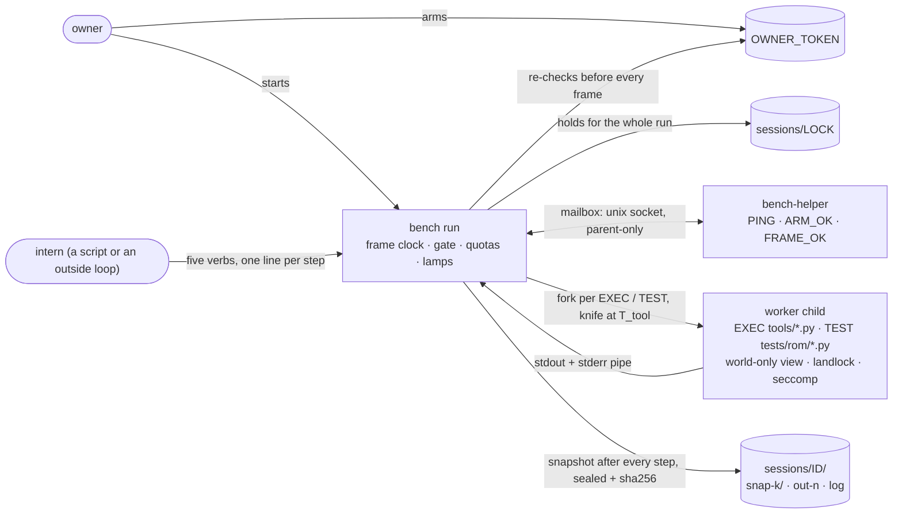
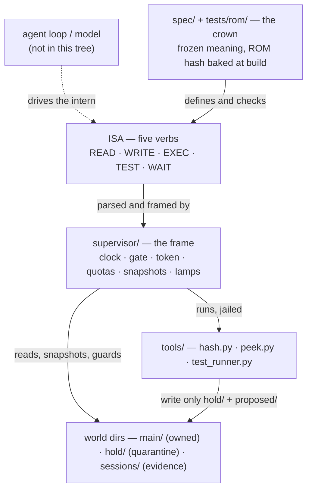
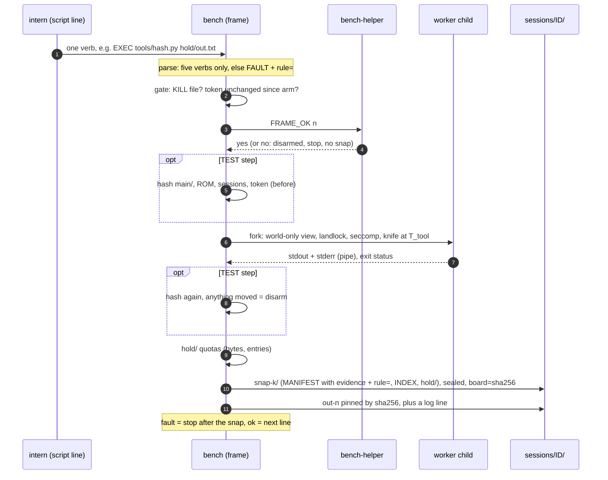
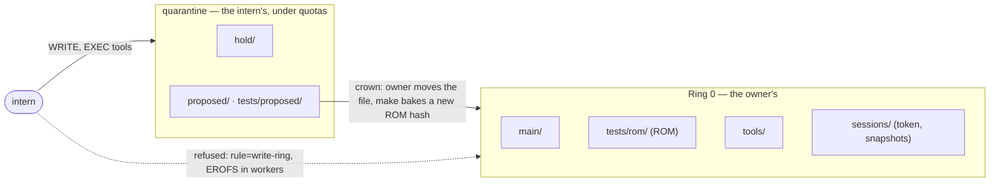

# Architecture

## Custody, not the loop

Most agent tools are a **loop**: prompt → model → tool call → observation → repeat. They own the
model and the context. Bench is the layer under a loop: the **custody** of the world the loop
works on. It owns the clock, the gate, the write rings and the evidence. It has no model.

| | Loop (the intern's driver) | Bench (custody) |
|---|---|---|
| decides | what to try next | whether a step may run, and what it cost |
| holds | context, prompts, the model | the world, snapshots, the owner's token |
| trusts | its own output | nothing the intern wrote, until the owner crowns it |

## Who starts whom



The intern has no path to the helper, the token, the lock or the log: it only hands `bench` lines
of text, which the parser accepts as one of five verbs or refuses with a rule id.

## How the layers stack



## Five verbs

| Verb | Meaning |
|---|---|
| `READ <slot> <path>` | bytes from a slot (`fs`) |
| `WRITE <slot> <path> <line>` | one line to a file under `hold/` or `proposed/` |
| `EXEC tools/<name>.py <args>` | run a program that lives in `tools/` |
| `TEST <kind> tests/rom/<t>.py` | run a crowned check |
| `WAIT <ms>` | yield for time, at most `T_tool` |

No sixth. A browser, a compiler, a judge or a planner is a program in `tools/` or a device in a
slot. `INSTALL_ROM`, `SET_LOOP`, `KILL`, `UNPLUG` are supervisor words; an intern that emits them
is refused at parse (`rule=verb-super`).

## The frame

```
gate (KILL · token · helper FRAME_OK) → [TEST: hash board] → worker → [TEST: post-conditions]
    → quotas → snapshot (sealed, content-hashed) → inhibit
```

One step, as it runs:



A step that did not snap did not happen. `T_frame` (200 ms) is bench's own work; `T_tool` (5 s)
is the worker's. Every refusal carries a stable `rule=` id and a one-line fix. Measured costs:
[`PERF_AND_MAP.md`](PERF_AND_MAP.md).

## Rings and the crown

- **Ring 0** — `main/`, `tests/rom/`, `tools/`, `sessions/`: the owner's. The intern writes none of
  them, by verb or by worker (workers see them read-only).
- **Quarantine** — `hold/`, `proposed/`: the intern's, bounded by quotas.
- **The crown** is a human act: the owner moves a draft from `proposed/` into Ring 0 and rebuilds
  (`make` bakes a new ROM hash). `bench run` refuses a ROM that changed since the build.



## The binary is the floor

The C supervisor is the only authority. The Python in `isa/` mirrors it for ROM tests and is
checked against the binary by tables (opcodes, write paths, slot gates, refusal rules); where they
disagree, the binary is what runs. The spec (`spec/BENCH_SPEC.md`) is above both: if the code and
the spec disagree, the code is wrong.

## Workers

Each `EXEC`/`TEST` child: its own mount namespace showing only the world (read-only except
`hold/`, `proposed/`, `tests/proposed/`), `/usr`, `/dev/null` and a private `/tmp`; landlock
(`EXEC`); seccomp (no network, no mount, no namespaces, no io_uring); a scrubbed env; a knife at
`T_tool`; an output ceiling. If the jail cannot be built, the worker does not start
(`rule=worker-setup`). Details: [`reference.md`](reference.md).

## Many worlds

A world is a directory with its own `sessions/LOCK`. `bench fork <snap> <dir>` makes a new world
from a verified snapshot (copies, never links; unarmed). Parallelism is many worlds, never two
runs on one lock.
